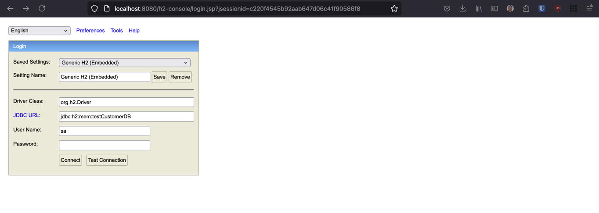
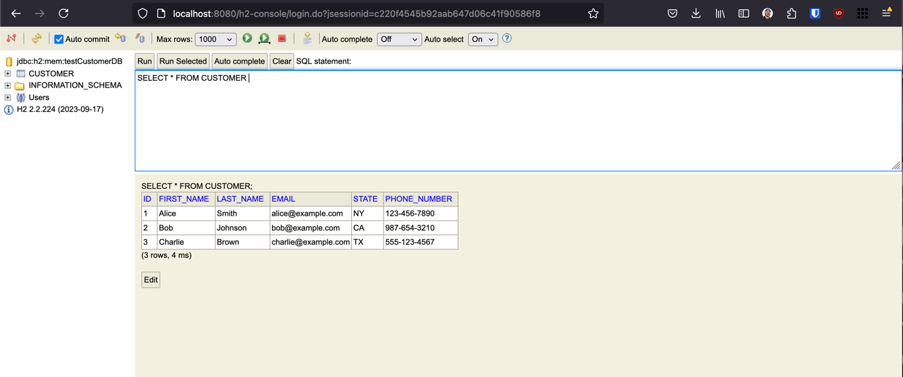
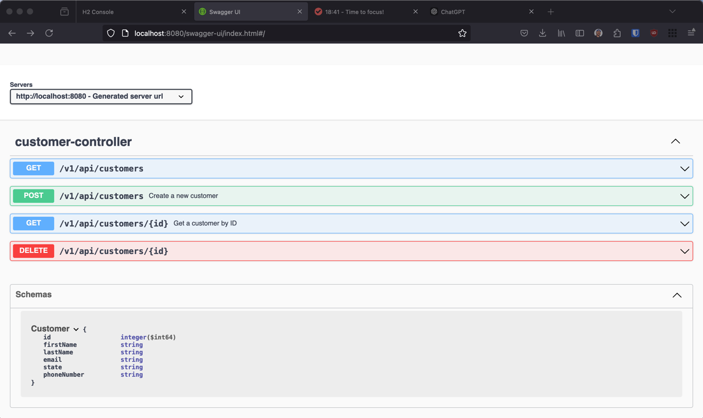
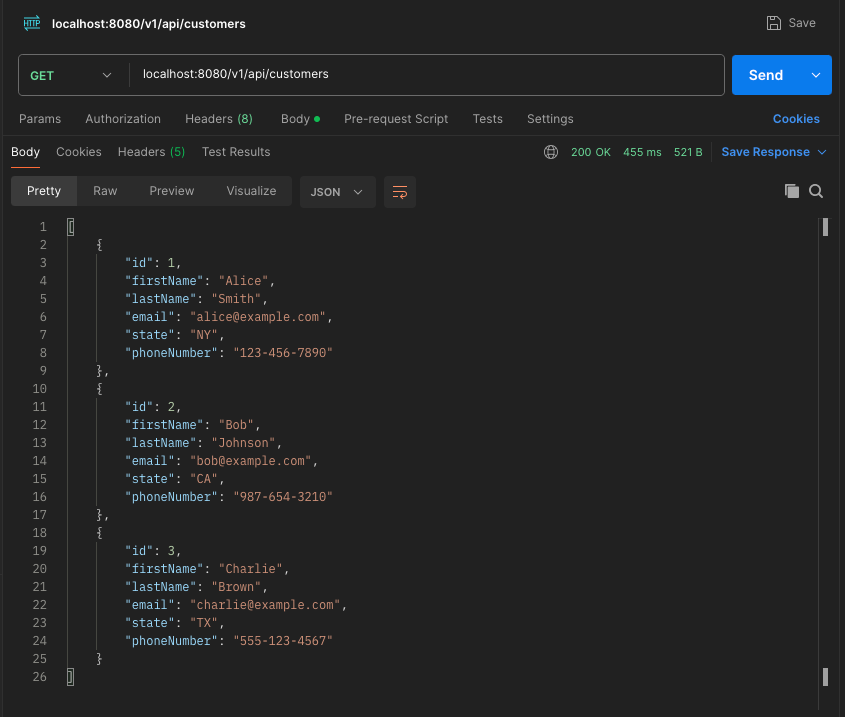
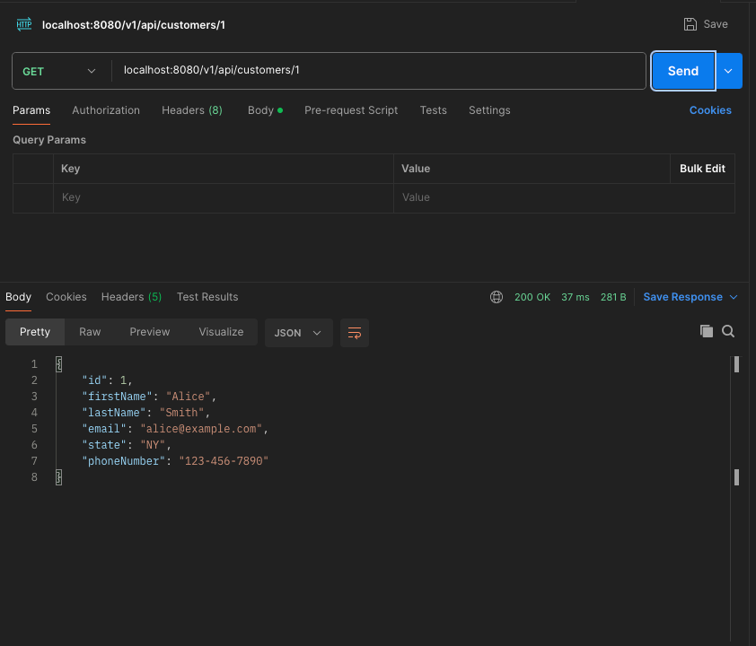
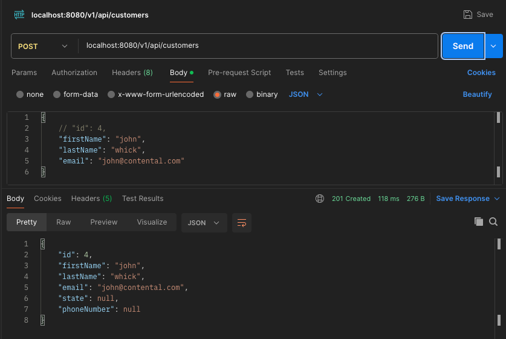
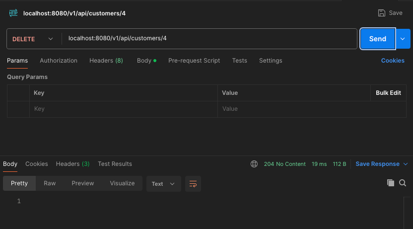

# Customer API

A simple Java API for managing customers using Spring Boot and H2 in-memory database.

## Prerequisites

- Java 21
- Gradle
- IDE (e.g., IntelliJ IDEA, Eclipse)

## Getting Started

1. **Clone the repository:**
   ```bash
   git clone https://github.com/KamtoOkafor/Dunder-Mifflin-Paper-Company-Customer.git
   cd customer
2. **Build the application**
    ```bash
   ./gradlew build

3. **Run the application**
    ```bash
   ./gradlew bootRun

4. **Testing**
    ```bash
    ./gradlew test

5. **To access the in memory database**
    ```bash
    http://localhost:8080/h2-console.
   
    JDBC URL: jdbc:h2:mem:testCustomerDB
    Username: sa
    Password: (n/a) (change this in application.yml if needed)

### How to Access the Application
- After running the application, you can access the API at `http://localhost:8080/api/customers`.
- You can visually view the data in the H2 console at `http://localhost:8080/h2-console`.
  
  


- You can access the swagger page at `http://localhost:8080/swagger-ui/index.html`.
  

### Using postman





### Note
- You can change the database password in `application.yml` under `spring.datasource.password`.
- The H2 console will allow you to view and manipulate the in-memory database visually.

With this setup, you should have a fully functional Java API for managing customers with unit and integration tests included! Let me know if you have any questions or need further assistance!

### If you were to scale your customer API service to millions of customers how would you build it differently?
1. I would use an actual SQL (Postgres, MySQL) database as opposed to an in memory database
2. I would add a caching layer (with an appropriate Time to live) so we won't have to make a lot of get calls to retrieve a list of customers or to view a single customer
3. I would add some RBAC and a confirmation screen for the delete endpoint (don't want anyone to willy-nilly delete a customer)
4. I would host this on Azure or AWS servers, Distributing read-heavy workloads to database replicas.
5. I would configure auto-scaling groups in cloud providers (AWS, Azure) to add or remove instances based on traffic.
6. I would add some rate limiting and throttling  and tracking for users accessing the defined endpoints
7. I would emit important metrics to a dashboard
8. I would add a lot more testing scenarios, currently my testing covers a lot of happy path testing, but I would also account for edge cases...(with more time obviously)
